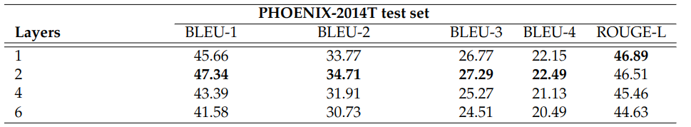
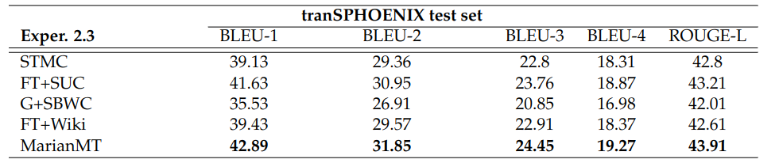
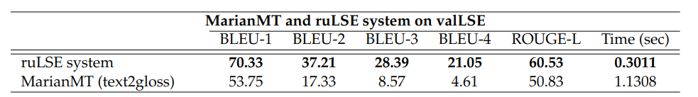

# CORPUS-SynLSE
This work is related to the upcoming paper _Synthetic Corpus Generation for Deep Learning Based Translation of Spanish Sign Language_. <!-- Añadir el vinculo al paper cuando esté -->

In this study, we propose two methods to synthetically create a gloss annotation corpus for LSE, and use them to explore the training hyperparameters of transformational models. In summary, the main contributions of this study are:
* To provide an overview of Deep Learning-based techniques approached to address the problem of communication between the deaf community and hearing people in the literature, as well as establish the main gaps in recent studies related to these tasks.
* The development of two methods to obtain synthetic gloss annotations in LSE: one based on the translation of an existing dataset (from German to Spanish), and another by a flexible rule-based system to translate from Oral Spanish (LOE, from _Lengua Oral Española_) to LSE glosses.
* The publication of a synthetic corpus including Spanish sentence pairs (LOE) and their corresponding translation to LSE glosses annotations.
* To carry out a set of experiments with language models based on Transformers using our synthetic datasets in both directions: the translation in LOE from LSE to written/oral language (gloss2text), and from written/oral language to glossed sentences (text2gloss).

Available code with the necessary scripts for the creation of the corpus and the corpus itself can be found in the following repository [LSEGloss2SpanishText](https://github.com/celiabotlop/LSEGloss2SpanishText.git)

## Table of contents
1. [Methodology](https://github.com/Deepknowledge-US/TAL-IA/tree/main/CORPUS-SynLSE#methodology)
  - [TransPHOENIX](https://github.com/Deepknowledge-US/TAL-IA/tree/main/CORPUS-SynLSE#transphoenix)
  - [ruLSE](https://github.com/Deepknowledge-US/TAL-IA/tree/main/CORPUS-SynLSE#rulse)
  - [valLSE](https://github.com/Deepknowledge-US/TAL-IA/tree/main/CORPUS-SynLSE#vallse)
2. [Implementation Details](https://github.com/Deepknowledge-US/TAL-IA/tree/main/CORPUS-SynLSE#implementation-details)
3. [Results](https://github.com/Deepknowledge-US/TAL-IA/tree/main/CORPUS-SynLSE#results)
4. [Future work](https://github.com/Deepknowledge-US/TAL-IA/tree/main/CORPUS-SynLSE#future-work)

### Methodology
Our proposed synthetic parallel corpus, SynLSE, for written LOE (Spanish) and LSE (gloss annotation) consists of three parts: tranSPHOENIX, ruLSE and valLSE. The former is going to be used to explore some hyperparameters for Transformer models, ruLSE is employed for a complete training of selected models, and valLSE is a small set with semi-validated sentences.

#### TransPHOENIX 
To generate a synthetic corpus for LSE, we first propose to translate into Spanish the subsets (train, test and development) that compose the RTWH-PHOENIX-2014T corpus, separately. Although the structure of the German sign language (GSL), as well as its glosses, does not completely correspond to the Spanish one, we believe that its use to create a synthetic corpus can be a good first approximation.

#### ruLSE
A set of transformation rules has been defined and a system capable of reading and applying rules has been implemented. The transformation rules defined cover up to B1 level (CEFR) in LSE, which were extracted from the books of _Confederación Estatal De Personas Sordas_ (CNSE). Approximately 80 rules have been collected.

#### valLSE
This dataset contains validated sentences to be used to test and compare the accuracy of the models when translating LOE to/from LSE. It is, in turn, split in two parts: 
- Macarena: A small set of 50 sentences from [Large Spanish Corpus](https://huggingface.co/datasets/large_spanish_corpus), which contains news in Spanish. These sentences are translated to LSE glosses by using our ruLSE system and have been semi-validated by an expert interpreter.
- Uvigo: The dataset LSE_UVIGO, but some words were modified to meet the notation followed by ruLSE.

### Implementation Details
For the set of experiments, two different models were used: STMC-Transformer and the MarianMT model. On the one hand, STMC-Transformer is referenced to the original transformer paper proposed by Vaswani et al. On the other hand, the MarianMT model is also derived from the "base" model of Vaswani et al., but in this case, it was originally trained using the Marian C++ library, which allows fast training and translation.

In summary, this set of experiments is organized into four groups:
- **Text2Gloss on the original PHOENIX-2014T dataset:** The STMC-Transfomer model is trained on the original (German) version of PHOENIX-2014T dataset to find the optimal number of layers in the model. We explore a different number of encoder-decoder layers: 1, 2, 4 and 6.
- **Text2Gloss on tranSPHOENIX dataset (from SynLSE):** A second block of experiments in which we train both models (STMC-Transformer and MarianMT model) on different subsets of tranSPHOENIX.
- **Text2Gloss on ruLSE dataset (from SynLSE):**  A third group of experiments focused on training the best STMC model from the previous group and MarianMT, and test their performance when trained on the more accurate, larger and synthetic dataset generated with ruLSE.
- **Gloss2Text when using ruLSE versus STMC-Transformer and MarianMT:** The last group of experiments consists of applying the STMC-Transformer and MarianMT models on the entire synLSE corpus but for Sign Language Production.

### Results

<figure>
  

  
  

</figure>

<em>STMC-Transformer model results for text2gloss with original PHOENIX-2014T dataset in German language.</em>

<figure>
  

  
  

</figure>

<em>Results obtained by training both models on the entire tranSPHOENIX dataset for text2gloss. In the Experiment 2.3 column, STMC stands for the configuration of STMC-Transformer model without using pretrained word embeddings, STMC+FT(SUC) for STMC-Transformer model with FastText embeddings from SUC, STMC+G(SBWC) to STMC-Transformer model with GloVe from SBWC, STMC+FT(Wiki) to STMC-Transformer model with FastText from Wikipedia and MarianMT for MarianMT model.</em>

<figure>
  

  
  

</figure>

<em>Results obtained by training both models on the ruLSE dataset for text2gloss. In the Experiment 3.1 column, MarianMT (x) stands for the configuration of MarianMT model trained on x sentences from ruLSE train set (for x being 1000, 3500 and 7500). STMC stands for the configuration of STMC-Transformer model without using pretrained word embeddings and STMC+FT(Wiki) to STMC-Transformer model with FastText from Wikipedia.</em>

<figure>
  

  
  

</figure>

<em>Results of MarianMT model trained on 7500 sentences from ruLSE versus ruLSE gloss generation system over the whole valLSE dataset (Macarena and Uvigo) for gloss2text.</em>

### Future work
In future work, we will keep focusing on Sign Language exclusively. Following the branch of Sign Language Translation, we will focus on applying techniques that use keypoint estimation to perform Sign Language Recognition, applying transformer models to do translation afterwards.

As for the ruLSE algorithm, we have identified with the interpreter some cases that are not covered by the currently defined set of rules. Therefore, as future work, new rules will be created to cover more complex scenarios, errors and sentences recognized by the interpreter to provide the algorithm with greater performance and variety.
