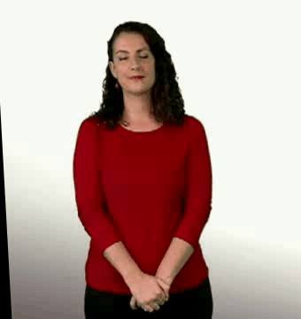
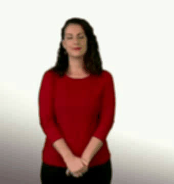

# Data Augmentation
What is *data augmentation*? How did we use it in this project? The answers to these questions and many others in this document.

## Theoretical basis

Within the field of data analysis, data augmentation or data expansion are a series of techniques used to increase the dimensions of the working dataset by considering, in addition to the original data, copies of the same with slight modifications, or even new data created from other inputs, the so-called synthetic data. This tool, in addition to partially overcome the problems associated with small datasets, allows us to reduce overfitting, a common problem in the models considered.

## Implementation

In the [Video augmentation in Python](https://github.com/RodGal-2020/video_augmentation) package we have developed a set of transformations capable of modifying data just enough for different deep learning models to improve their performance by resorting to these videos. With the aforementioned package it is possible to launch an experiment like the following:

```python
import video_augmentation_functions as va
va.set_seed(1974) # Guaranteed reproducibility of the experiment by using one seed

## Work folders
my_input_dir = "data/"
my_input_format = "mp4"

my_output_format = "mp4" # Also supports "avi"
my_output_dir = "new_data/augment/"

my_log_dir = "logs/augment.log"

## Boolean values
my_save_video = True # Do we want to save the video in output_dir?
my_show_video = True # Do we want to show the video?
my_show_size = True # Do we want to show the dimensions of the video in the title?
my_slow = False # Do we want to play the video at the real speed or at the speed read by the opencv package?
my_debug_mode = False # Do we want to show additional information, useful for debugging?

## Other parameters
my_seconds_before_action = 0 # Seconds before starting to watch the video, useful if we want to skip some elements
my_noise_prob = 0.1 # Probability to add noise to the video (only for salt and pepper transformations)
my_transformations = ["aff", "bpepper", "bsalt", "blur", "mblur", "apepper", "asalt", "dsample-0.1", "usample-0.2"] 

### Execution
va.augment(
    input_dir = my_input_dir, 
    output_dir = my_output_dir, 
    input_format = my_input_format, 
    output_format = my_output_format, 
    show_video = my_show_video, 
    save_video = my_save_video, 
    slow = my_slow, 
    show_size = my_show_size, 
    seconds_before_action = my_seconds_before_action, 
    transformations = my_transformations, 
    noise_prob = my_noise_prob,
    debug_mode = my_debug_mode,
    log_dir = my_log_dir)
```

Launching the above code, from the folder `my_input_dir = "data"` and the `mp4` files in it we would generate a new folder `my_output_dir = "new_data/augment/"`, in which the input folder videos would appear transformed according to the commands included in `my_transformations`. To show an example we will start from the word "Algebra", from the SACU dataset:

<p align='center'><br><sup>Original video processed for the word "Algebra".</sup><br></p>

We can see the appearance of each of these transformations applied to the above video below, although it should be noted that the above command would generate, for this particular video, another video applying **all** the transformations:

<p align='center'><br><sup>From left to right: affinity, then pepper, then salt.</sup><br></p>
<p align='center'><br><sup>From left to right: blurring, salt before, subsampling (acceleration) with probability 0.1.</sup><br></p>
<p align='center'><br><sup>From left to right: medium blur, oversampling (slowdown) with probability 0.2.</sup><br></p>
