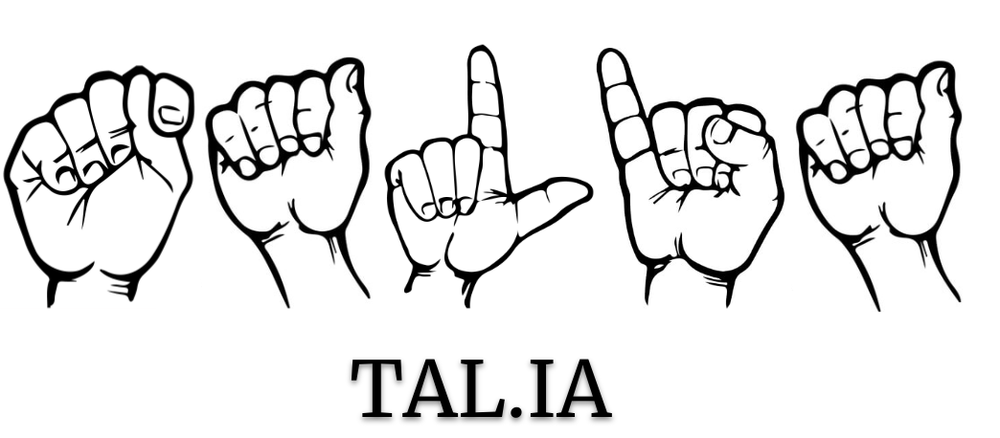

# TAL.IA: TrAducción de la Lengua de signos mediante Inteligencia Artificial

 
  
  Sign Languages (SL) are the main medium of communication for the deaf community. However, only the deaf themselves, their families and interpreters (less than 1% of the total population) learn it. Consequently, improving communication with hearing people is a fundamental need for the deaf community. In this sense, this project covers different studies of Deep Learning techniques applied to improve communication and quality life for deaf people. 

## Table of contents

1. [Data Augmentation and Deep Fakes for SLR](https://github.com/Deepknowledge-US/TAL-IA/tree/main/Data%20Augmentation%20and%20DF%20for%20SLR)
2. LSE Gloss2SpanishText
3. [Other works](https://github.com/Deepknowledge-US/TAL-IA#Other-works)
  
### Data Augmentation and Deep Fakes for SLR
This study addresses the challenge of improving communication between the deaf and hearing community by exploring different Sign Language Recognition (SLR) techniques. Due to privacy issues and the need for validation by interpreters, creating large-scale sign language (SL) datasets can be difficult. This issue is addressed by presenting a new Spanish isolated sign language recognition dataset, CALSE-1000, consisting of 5000 videos representing 1000 glosses, with various signers and scenarios. 
The study also proposes using different computer vision techniques, such as deepfakes and affine transformations, to augment the SL dataset and improve the accuracy of the model I3D trained using them. 

### LSE Gloss2SpanishText
In this research, a rule-based system, called ruLSE, is presented to generate synthetic Spanish Sign Language datasets. To test the usefulness of these datasets, experiments are performed with two state-of-the-art transformer-based models, MarianMT and Trasformer-STMC. 

### Other works
In a first instance, a mobile application named [SignUS](https://github.com/Deepknowledge-US/TAL-IA/tree/main/signus) was developed to collect videos of deaf people, signers and interpreters in order to get a semi-labeled set of videos (the user records a predetermined phrase, but without segmenting each gloss). Although approximately 20 associations of deaf people are contacted, we do not get users that allow us to accumulate a new dataset. 
However, the application is easily adaptable to recording the deaf person and supplying the video to a translation model that returns the text to the deaf person.

In addition, we are carrying out a master's degree final project associated with our working group related to this study, more specifically:
- [Sign2Text: Automatic Sign Language Translation.](https://github.com/manromero/transformer-slt)

## Acknowledgments

The project was supported by [FEDER/Junta de Andalucía - Paidi 2020/ _Proyecto P20_01213](https://investigacion.us.es/sisius/sis_proyecto.php?ct=1&cs=&idproy=33683), which consists of the following members:
- [Juan Antonio Álvarez García](https://www.linkedin.com/in/juanantonioalvarezgarcia/) (PI)
- [Miguel Ángel Martínez del Amor](www.cs.us.es/~mdelamor) (research team)
- [Fernando Sancho Caparrini](www.cs.us.es/~fsancho) (research team)
- [Luis Miguel Soria Morillo](https://es.linkedin.com/in/lsoriamo) (research team)
- [Álvaro Arcos García](https://es.linkedin.com/in/alvaroarcos) (collaborator team) 
- [Diego Cabrera Mendieta](https://scholar.google.es/citations?user=ZIKw_DAAAAAJ&hl=es) (collaborator team)
- [Javier de la Rosa Pérez](https://www.linkedin.com/in/versae) (collaborator team)
- [Marina Perea Trigo](https://es.linkedin.com/in/marina-perea-trigo-0a2995189) (collaborator team)
- [Macarena Vilches Suárez](https://es.linkedin.com/in/macarenavilchess) (collaborator team)
- [José Luis Salazar González](https://es.linkedin.com/in/jose-luis-salazar-gonzalez-644136143) (staff)
- [José Antonio Rodríguez Gallego](https://es.linkedin.com/in/jos%C3%A9-antonio-rodriguez-gallego-bb2967176) (staff)
- [José Morera Figueroa](https://es.linkedin.com/in/jos%C3%A9-morera-figueroa-2344b0210) (staff)

The research associated with this project was also supported by grants from NVIDIA and used an A100 GPU donated by the NVIDIA HW Grant awarded to our colleague Miguel A. Martinez-del-Amor. 

We would like to especially thank the following team members for their work:
- Macarena Vilches Suárez
- José Antonio Rodríguez Gallego
- José Morera Figueroa
- José Luis Salazar González

