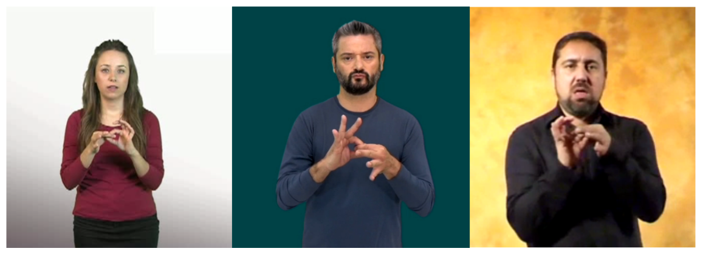
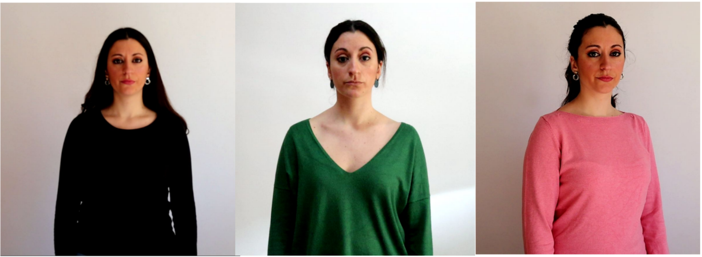
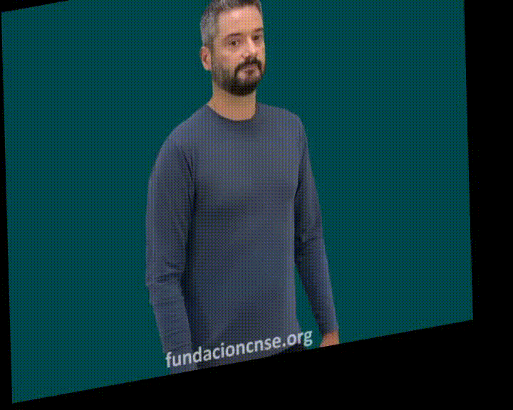
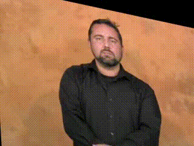

# TAL.IA: TrAducción de la Lengua de signos mediante Inteligencia Artificial

 
  
Sign Languages (SL) are the main medium of communication for the deaf community. However, only the deaf themselves, their families and interpreters (less than 1% of the total population) learn it. Consequently, improving communication with hearing people is a fundamental need for the deaf community. In this sense, this project proposes a system that, through the use of Artificial Intelligence (AI) techniques applied to Spanish Sign Language by means of computer vision, allows to convert a message in SL to its voice/text translation. 
  

## Table of contents
1. [Methodology](https://github.com/Deepknowledge-US/TAL-IA/edit/main/README.md#methodology)
    - [CALSE-100 Dataset](https://github.com/Deepknowledge-US/TAL-IA/edit/main/README.md#calse-100-dataset)
    - [Data augmentation](https://github.com/Deepknowledge-US/TAL-IA/edit/main/README.md#data-augmentation)
    - [Deepfakes](https://github.com/Deepknowledge-US/TAL-IA/edit/main/README.md#deepfakes)

2. [Implementation details](https://github.com/Deepknowledge-US/TAL-IA/edit/main/README.md#implementation-details)

3. [Results](https://github.com/Deepknowledge-US/TAL-IA/edit/main/README.md#results)

4. [Future work](https://github.com/Deepknowledge-US/TAL-IA/edit/main/README.md#future-work)

## Methodology

The first aim is to gather a sufficiently extensive dataset for training models focused on Isolated Sign Language Recognition (ISLR). For this purpose, a dataset called CALSE-100 (Conjunto Aislado de Lengua de Signos Española) composed of 100 gloss with 600 videos in total collected from different data sources has been defined and is available at [this address](https://uses0-my.sharepoint.com/:f:/g/personal/mptrigo_us_es/EnaUwfyXahFPoSOg_mj4JwEBsRXjKIVNDtMYpAqv714bhg?e=Q7tJ7L).   

In addition, data expansion techniques have been applied: [*data augmentation*](https://github.com/Deepknowledge-US/TAL-IA/tree/main/data_augmentation), which is usually used in several fields of deep learning to improve the quality and size of the training set, as well as [*Deepfakes*](https://github.com/Deepknowledge-US/TAL-IA/tree/main/deepfakes), which besides expanding the content of the training set will allow to anonymize the data while maintaining the facial expression of the signs.

### CALSE-100 Dataset 
The CALSE-100 set has been formed by obtaining videos from 3 different, publicly available data sources, which are the Dictionary of Spanish Sign Language ([DILSE](https://fundacioncnse-dilse.org/)) and Spread the Sign ([STS](http://www.spreadthesign.com/es.es/search/)) dictionaries, as well as the dataset from the University Community Assistance Service ([SACU](https://sacu.us.es/ne-prestaciones-discapacidad-glosario)) of the University of Seville.

CALSE-100 is composed of 100 gloss, with three video samples of each gloss extracted from the sources described above.

In addition, this set has also been signed by a professional Spanish Sign Language interpreter, thus being able to add more examples for each word in the set. Thanks to this collaboration, 3 more items of each word have been incorporated, thus obtaining a total of 6 examples of each word. 

To ensure that the sign language recognition model can handle the diverse scenarios that can arise in everyday life, it is essential to include variations in the signs' appearance and singing paces during training. To achieve this, we have defined several scenarios for the repetitions of videos signed by the interpreter. These scenarios include changes in perspective (such as front view or profile), the emphasis during sign execution, and variations in clothing, among other factors. 
This approach helps to introduce variability between different elements of the same signed words, ultimately leading to an enhanced dataset and a more robust model.

### Data augmentation
To increase datasets size that will launch augmentations on the videos, a new, publicly available [library](https://github.com/RodGal-2020/video_augmentation) has been used.

Although several functions are implemented to apply transformations, we will only consider affine transformations, since it includes the classical transformations, i.e. translations, reflections, scalings and rotations. In addition, the function applies a random affine transformation, which may therefore result in the application of one of the above transformations. However, the library adds the possibility to apply these transformations individually, in order to provide a complete tool.

### Deepfakes
To avoid possible problems in maintaining identity through anonymization of the data, the [FaceSwap](https://github.com/deepfakes/faceswap) tool has been used, which employs Deep Learning techniques to recognize and swap faces in each of the signers that make up the CALSE-100 dataset

The face swapping to generate Deepfakes is composed of 3 stages: 
- Extraction: in this first stage, the extraction of faces from the target video for the later training takes place, in which face landmarks are recognized and the images are cropped, saving the faces to be used for training. In this first step, it is important to have a large set of images containing the face of the subject to be trained, as well as to consider the data's quality and the variety of angles and expressions.
- Training: in this step, the training of the `Phaze-a' model from FaceSwap is executed for 35,000-40,000 iterations (it depends on the models used for the face swapping), with a batch size of 10.
- Conversion: in this last stage, the face extraction is performed again (in this case, on the source video) and then the face swapping is performed to obtain the final set of videos with Deepfakes applied.

## Implementation details

## Results 

## Líneas de trabajo futuras

