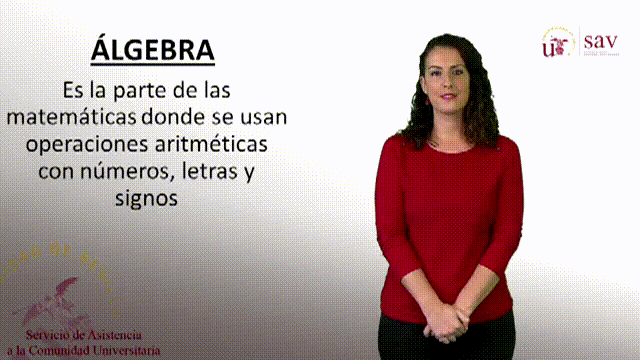

# TAL.IA: TrAducción de la Lengua de signos mediante Inteligencia Artificial

La lengua de signos es la herramienta fundamental de la que dispone una persona sorda para comunicarse. Sin embargo, esta lengua solo la aprenden, además de los sordos, sus familiares e intérpretes (en total, menos del 1% de la población). Así pues, conseguir comunicarse con un porcentaje mucho mayor de la población se convierte en una necesidad fundamental para la comunidad sorda. En este sentido, con el fin de mejorar la comunicación entre personas sordas y oyentes, este proyecto plantea un sistema que, aplicando las últimas técnicas de Inteligencia Artificial (IA) aplicadas a la Lengua de Signos (LS) Española mediante visión por computador, permita convertir un mensaje expresado en LS a su traducción en voz/texto. En ese sentido lo primero es generar un dataset lo suficientemente amplio.

## Sobre este documento
- README en desarrollo, pero ya con algo de contenido que mostrar.
- Repositorios auxiliares prácticamente vacíos.
  - Pero con estilo.

## Objetivos

Las dos principales herramientas en las que hemos centrado nuestra atención son la expansión de datos (*data augmentation*) y los *deepfakes*, transformaciones que actualmente están cambiando el campo de la Inteligencia Artificial, y que pretendemos usar emplear en el caso del Reconocimiento del Lenguaje de Signos (SLR).

Referencias:
* [*Data augmentation*](https://github.com/Deepknowledge-US/TAL-IA/tree/main/data_augmentation)
* [*DeepFakes*](https://github.com/Deepknowledge-US/TAL-IA/tree/main/deepfakes)

## El conjunto de datos de la Universidad de Sevilla

TODO: Origen, obtención, procesamiento con MediaPipe.

* [Glosario en Lengua de Signos Española].

Originales:

 Vídeo original para la palabra "Álgebra". 

Muestra del recorte basado en [MediaPipe](https://mediapipe.dev/):

 Estimación de la *pose* con MediaPipe. 

Tras el procesamiento:

 Vídeo procesado para la palabra "Álgebra". 

## Resultados obtenidos

### SACU-100
 
 Pincha [aquí](img/under_development.jpeg) para acceder a este conjunto de datos.
 
> **TODO**:
  - Explicar la metodología empleada.
  - Comentar algunas estadísticas sobre el conjunto de datos.
  - Un par de gifs con ejemplos de contenido.
  

### SACU-I3D-10

Pincha [aquí](img/under_development.jpeg) para acceder a este conjunto de datos.

Este conjunto se ha creado con **8 clases** tomadas de las palabras del SACU, a saber: alcazar, desierto, blog, apagar, error, fe, cementerio, obispo. Las palabras han sido escogidas al ser comunes y poder encontrarse en otros diccionarios. De hecho, para poder trabajar con un conjunto de datos un poco más complejo, hemos añadido 7 vídeos adicionales del diccionario Spread the Sign, y 8 del Dilse, con la idea de poder usar un conjunto test novedoso.

Para poder poner a prueba nuestra hipótesis —la utilidad de la expansión de datos (*data augmentation*) y de los *deepfakes* para mejorar la precisión de un modelo— optamos por realizar un número considerable de experimentos recurriendo a este conjunto, contemplando en cada caso diferentes configuraciones para obtener información útil. Adicionalmente, cabe destacar que recurrimos al modelo I3D de reconocimiento del lenguaje de signos, tal y como es empleado en el artículo de presentación del conjunto de datos WLASL, *WLASL-LEX: a Dataset for Recognising Phonological Properties in American Sign Language*.

Usamos $S$ para denotar al conjunto de los 10 vídeos originales con los que trabajamos —$S_{I}$ representará a los signantes identificados por $I$ de $S$—, $T_1$ y $T_2$ para las transformaciones, $DF$ para los *DeepFakes*, y D para el conjunto test, formado por 8 vídeos del diccionario Dilse:

$$T_1 = ('aff', 'apepper', 'blur', 'usample-0.1')$$

$$T_2 = ('aff', 'bsalt', 'mblur', 'dsample-0.2')$$

| ID | Épocas | Clases | Entrenamiento | #Entrenamiento | Test | Precisión | Notas |
|:-:|:-:|:------:|:-------------:|:----:|:----:|:---------:|:-----:|
| 10-02 | 52 |  8     | $T_1(S) + T_2(s)$ | 30 | D | 0.125 | Empezaba con 0.25, pero al poco se redujo |
| 10-03 | 60 | 8 | $S + T_1(S) + T_2(s)$ | 45 | D | 0.25/0.375 | Existe variación, llegando a 0.375 en varias ocasiones |
| 10-04 | 51 | 8 | $S$ | 15 | D | 0.125 | |
| 10-05 | 51 | 8 | $T_1(S)$ | 15 | D | 0.125 | |
| 10-06 | 33 | 8 | $S + DF(S_{1,2})$ | 26 | D | 0.125 | |
| 10-07 | ?? | 8 | $S + T_1(S)$ | 32 | D | 0.25 | Mejoras claras desde el principio |
| 10-08 | 32 | 8 | $S + T_1(DF(S_{1,2}))$ | 26 | D | 0.125 | Nótese que no se considera $T_1(S \setminus S_{1,2})$ |
| 10-09-01 | 22 | 8 | $S + T_1(S) + DF(S_{1,2})$ | 42 | D | 0.125 | Llega a 0.25 y 0.375 al principio |
| 10-09-01 | 100 | 8 | $S + T_1(S) + DF(S_{1,2})$ | 42 | D | 0.375 | 0.25 subiendo en 252 pasos, llegando a 0.375 más adelante |
| 10-09-02 | 25 | 8 | $S + T_1(S) + T_1(DF(S_{1,2}))$ | 42 | D | 0.375 | LLega a 0.25 en 162 pasos, y en 266 a la marca|
| 10-09-02 | 100 | 8 | $S + T_1(S) + T_1(DF(S_{1,2}))$ | 42 | D | 0.375 | A partir del paso 360 empieza a bajar y luego se estabiliza en 0.125 |

> **Nota**: En cada paso se actualizan los pesos y se trabaja con un lote del conjunto de entrenamiento.

## Trabajo relacionado

## Líneas de trabajo futuras

## Líneas de trabajo descartadas

- Traducción del Lenguaje de Signos (SLT).

